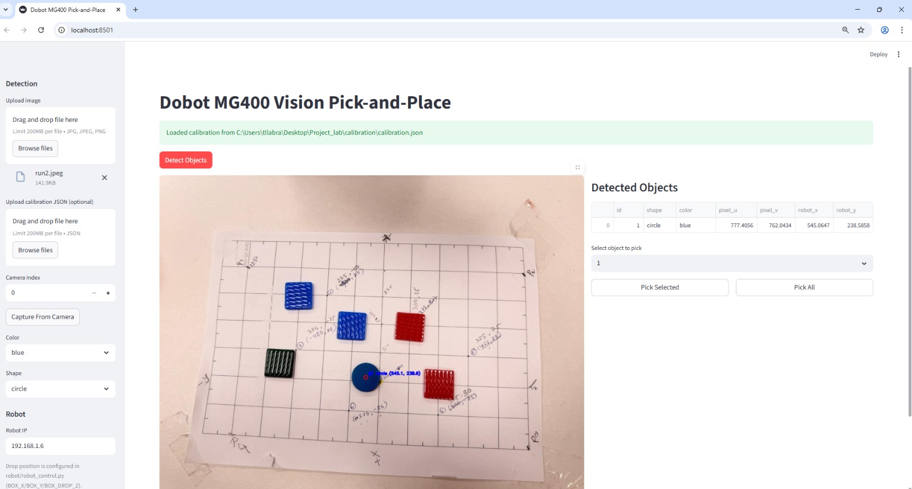
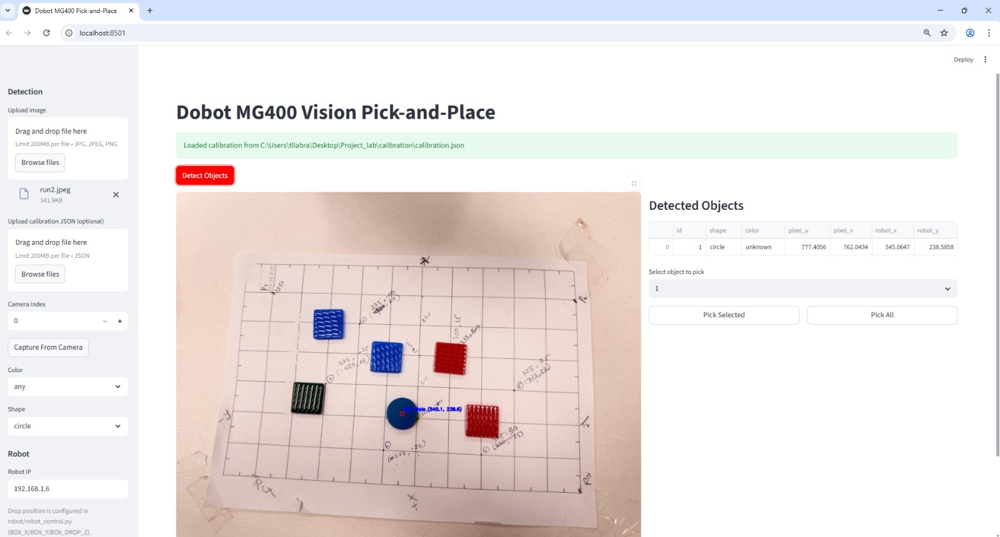
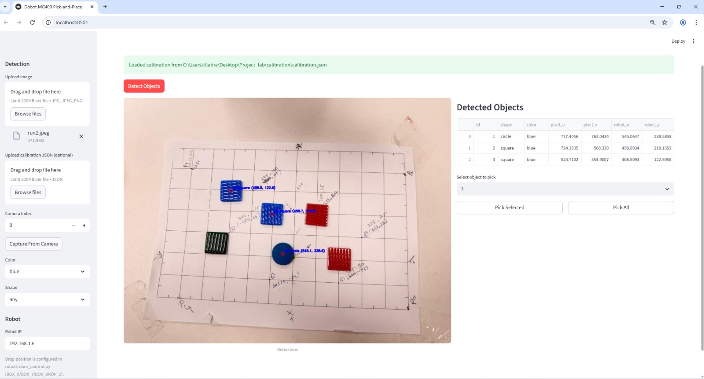
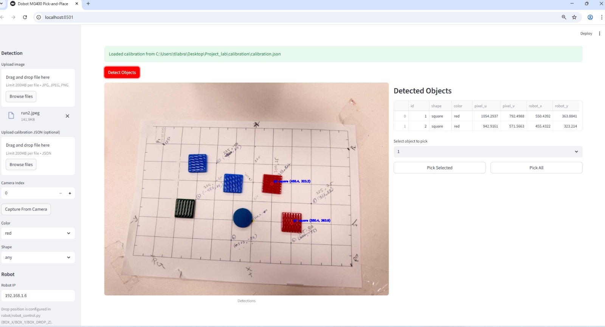
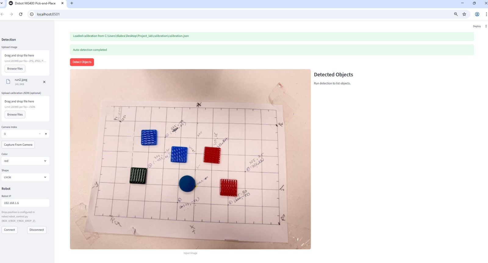

# Lab Report — Vision-Guided Pick & Place with Dobot MG400

**Submitted by:**
Md Jahidul Islam

K M Arafat Islam

---

## Objective

Design and implement a vision-guided system that:

* Captures an image from a fixed camera
* Detects colored tiles/objects on a planar workspace
* Maps pixel coordinates to robot workspace coordinates using 4-point homography
* Commands a Dobot MG400 robotic arm to pick and place detected objects

---

## System Architecture Overview

The system consists of five main modules:

1. Calibration
2. Perception
3. Robot Control
4. Entry Point (CLI)
5. Operator UI

---

## 1️⃣ Calibration Module

### File:

```
calibration/calibration.py
```

### Purpose:

* Collect 4 corresponding pixel points and robot (X,Y) points
* Compute homography matrix H
* Save matrix into:

```
calibration/calibration.json
```

### Output:

* 3×3 Homography matrix H stored in JSON file

## 2️⃣ Perception Module

### File:

```
perception/detect_color.py
```

### Functionality:

* Capture one camera frame
* Convert frame to HSV
* Apply non-white color masking
* Perform morphological filtering
* Detect contours
* Calculate centroids
* Apply homography H to compute robot (X,Y) coordinates
* Save annotated output image

## 3️⃣ Robot Control Module

### Low-Level API

```
robot/dobot_api.py
```

* TCP/IP communication
* Dashboard (Port 29999)
* Move (Port 30003)
* Feed (Port 30004)

---

### Controller Layer

```
robot/dobot_controller.py
```

* Robot connection
* Feedback thread
* WaitArrive logic
* MoveL / MoveJ commands
* Digital output control

---

### High-Level Control

```
robot/robot_control.py
```

Functions:

* `robot_connect()`
* `pick_one(X, Y)`
* `robot_disconnect()`

Includes:

* Vacuum digital output sequence
* Predefined box drop pose

---

## 4️⃣ Entry Point (CLI)

### File:

```
main.py
```

Used to run:

### Plan Mode

```bash
python main.py detect --mode plan
```

* Detect objects
* Print:

  * Pixel (u,v)
  * Robot (X,Y) in mm
* Save annotated image
* No robot movement

---

### Execute Mode

```bash
python main.py detect --mode execute
```

* Confirm execution
* Connect to robot
* Pick detected objects
* Place into box

---

## 5️⃣ Operator UI (Streamlit)

### File:

```
ui/app.py
```

### Features:

* Capture camera frame
* Detect objects
* Convert pixel to robot coordinates
* Display annotated result
* Connect to Dobot MG400
* Execute full pick-and-place cycle safely

---

### UI Screenshot





---
# Development Choices

## 1. Planar Homography

A 4-point planar homography maps:

```
Image (u, v)  →  Workspace (X, Y)
```

Advantages:

* Suitable for rigid planar workspace
* No need for full 3D calibration
* Efficient and accurate when Z is fixed

---

## 2. Color Segmentation & Centroid

* Broad HSV range filters non-white regions
* Morphology removes noise
* External contours detect objects
* Centroids provide stable pick points

---

## 3. Single-Frame Detection

* On-demand capture
* Simplifies synchronization
* Operator validates pick positions

---

## 4. Dobot TCP/IP Control

* Dashboard: Enable, IO, Speed
* Move: Motion control
* Feed: Status feedback
* WaitArrive ensures safe sequencing

---

# Operation

## Plan Mode (Detection Only)

Command:

```bash
python main.py detect --mode plan
```

Output:

* Prints:

  * Pixel coordinates (u, v)
  * Robot coordinates (X, Y) mm
* Saves annotated detection image
* No robot motion


## Execute Mode (Pick & Place)

Command:

```bash
python main.py detect --mode execute
```

Process:

1. System asks confirmation
2. Robot connects
3. Robot moves to object
4. Vacuum ON
5. Move to box
6. Vacuum OFF
7. Repeat


# Discussion

The development of this system was relatively straightforward because:

* Homography-based pixel-to-workspace calibration is efficient and reliable
* HSV color segmentation is simple and fast
* Previous lab sessions provided foundation knowledge

Dobot’s TCP/IP API offered:

* Clear motion control structure
* IO management
* Real-time feedback
---

## Future Improvements

* Color-specific object classification (bonus task)
* More advanced Streamlit UI
* Multi-object tracking
* Error detection & recovery
* Speed optimization

---

## Conclusion

The system is:

* Reliable
* Accurate for tile manipulation
* Easily extendable
* Safe for operator interaction

It demonstrates a complete pipeline from:
Camera → Vision → Calibration → Robot Motion → Object Placement

---
